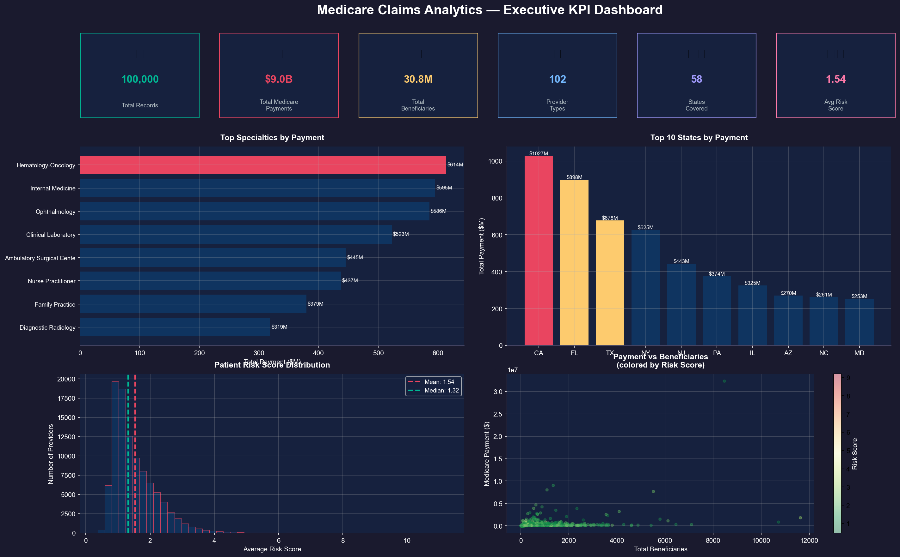
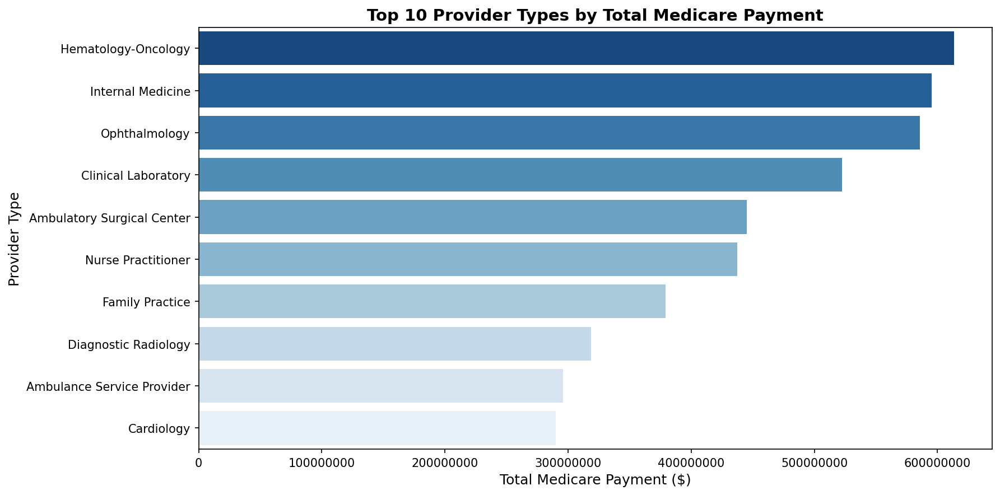
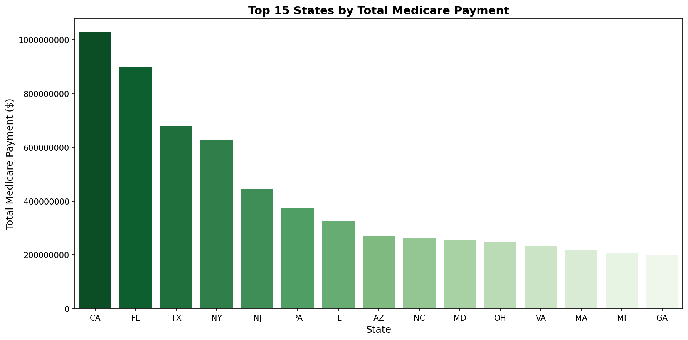
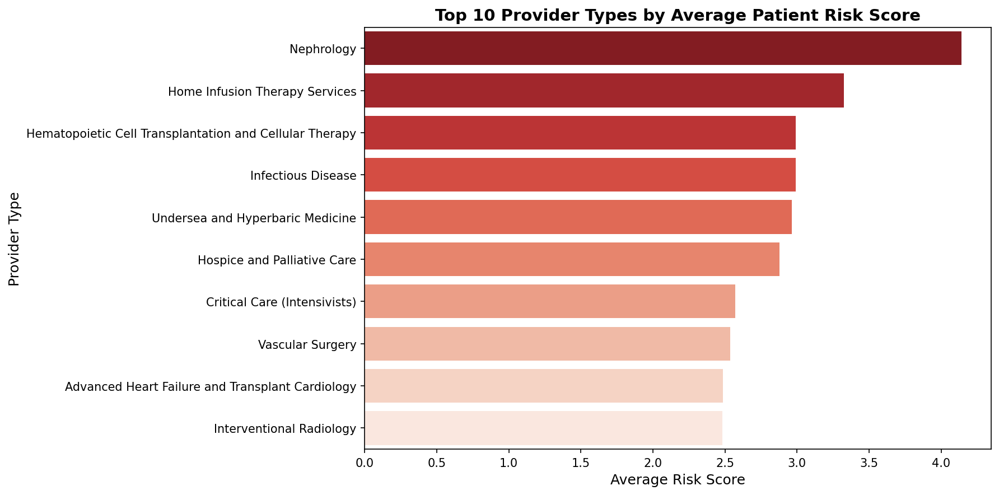
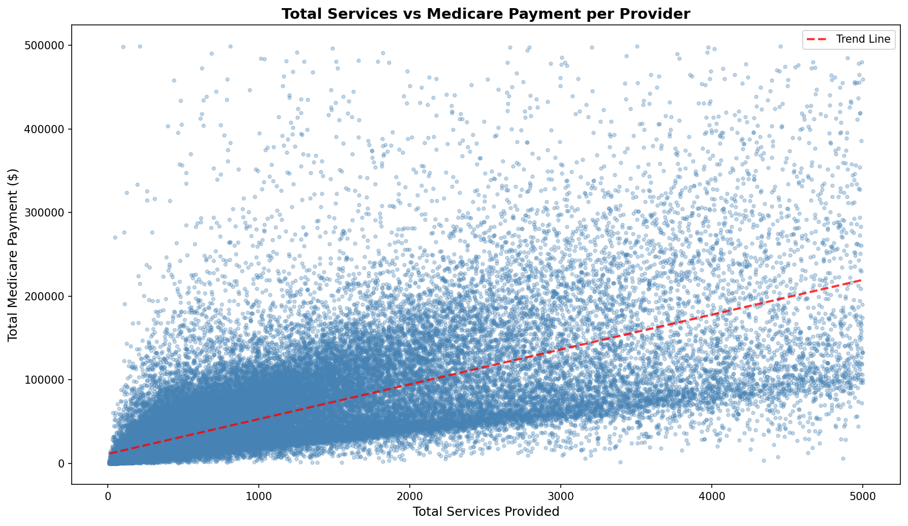
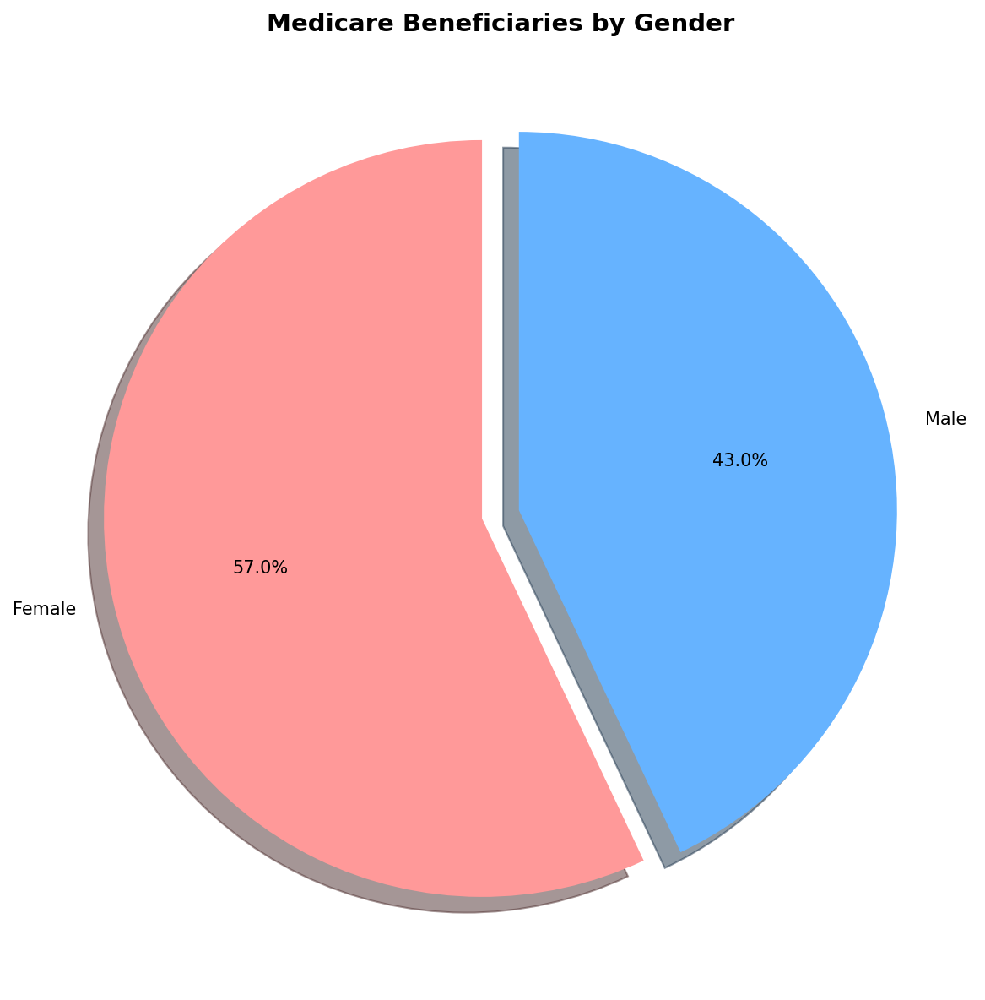
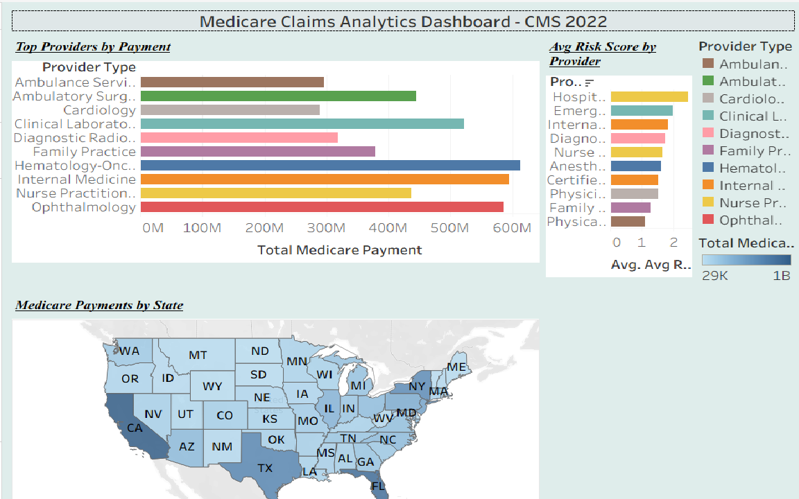
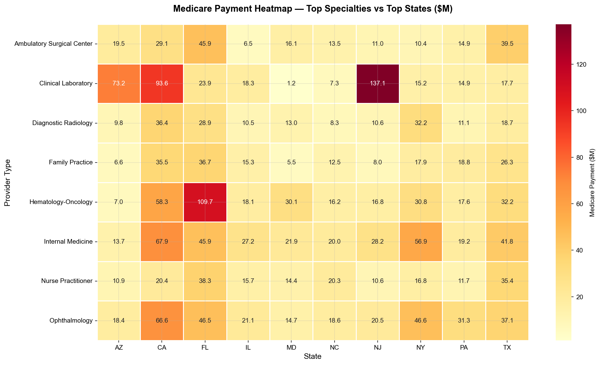
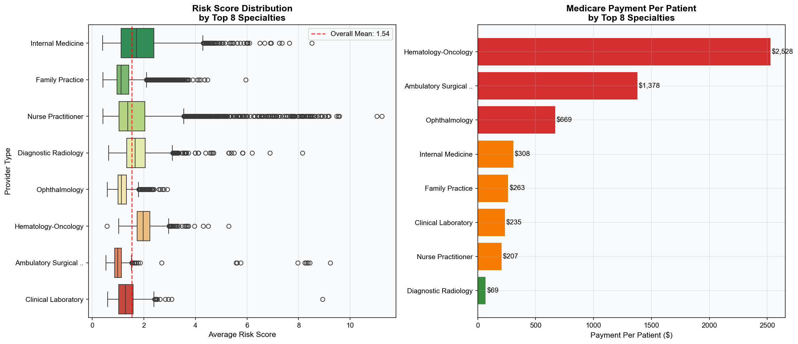

# 🏥 Medicare Claims Analytics Project
## End-to-End Healthcare Analytics Pipeline | Python · SQL · Tableau · Excel

## 🎯 Project Overview
End-to-end healthcare analytics project analyzing **100,000+ real Medicare records** from CMS 2022 dataset. Built in 2 phases from raw ETL pipeline to advanced SQL analysis, automated data quality framework, and executive KPI dashboards.

## 📊 Key Metrics
| Metric | Value |
|--------|-------|
| 📝 Records Analyzed | 100,000+ |
| 💰 Total Medicare Payments | $8.9 Billion |
| 👥 Total Beneficiaries | 30.7 Million |
| 🏥 Provider Types | 102 |
| 🗺️ States Covered | 58 |
| ⚕️ Avg Patient Risk Score | 1.54 |

## 🔍 Key Findings
- 💰 **Hematology-Oncology** charges **$2,528 per patient** highest of all specialties
- 🚨 Identified **15+ high-value providers** billing 200%+ above specialty average compliance risk
- 📍 **California** leads with $1B+ in payments; **Texas** ranks 3rd at $678M
- 🏥 **Clinical Laboratory in NJ** is the biggest state-specialty outlier at $137M
- 📊 **Diagnostic Radiology** most cost-efficient at $69 per patient
- 🔴 **Florida** has highest patient risk score (1.71) and oldest patients (73.7 avg age)

## 🛠️ Tech Stack
| Category | Tools |
|----------|-------|
| Language | Python 3.12 |
| Data Processing | Pandas, NumPy |
| Database | SQLite (via SQLAlchemy) |
| Visualization | Matplotlib, Seaborn, Tableau |
| Reporting | OpenPyXL (Excel) |
| Version Control | Git, GitHub |
| Environment | Jupyter Notebook, VS Code, Anaconda |

## 📁 Project Structure
healthcare-claims-project/
│
├── data/                            → Raw CMS Medicare 2022 dataset
├── notebooks/
│   ├── 01_data_exploration.ipynb    → Phase 1: ETL, cleaning, basic charts
│   └── 02_advanced_analysis.ipynb  → Phase 2: SQL, KPIs, advanced charts
├── output/
│   ├── medicare_clean.csv           → Cleaned dataset (Phase 1)
│   ├── medicare_analytics.db        → SQLite database (Phase 2)
│   ├── medicare_quality_report.xlsx → Automated quality report (Phase 2)
│   ├── executive_kpi_dashboard.png  → Executive dashboard (Phase 2)
│   ├── heatmap_specialty_state.png  → Heatmap (Phase 2)
│   ├── risk_payment_analysis.png    → Risk & payment (Phase 2)
│   ├── top_providers.png            → Top providers chart (Phase 1)
│   ├── top_states.png               → Top states chart (Phase 1)
│   ├── avg_risk_score.png           → Risk score chart (Phase 1)
│   ├── services_vs_payment.png      → Scatter plot (Phase 1)
│   ├── gender_distribution.png      → Gender pie chart (Phase 1)
│   └── dashboard.png                → Tableau dashboard screenshot
└── README.md
## 🚀 Phase 1  Data Exploration & Visualization
### What We Built
- ✅ Loaded and explored 100,000 real CMS Medicare records
- ✅ Selected 15 key columns from 81 total
- ✅ Built data cleaning pipeline with null handling and validation
- ✅ Saved clean dataset for downstream analysis
- ✅ Built 5 professional visualizations

### Phase 1 Visualizations

#### Top 10 Provider Types by Medicare Payment

#### Top 15 States by Medicare Payment

#### Average Patient Risk Score by Provider Type

#### Services vs Medicare Payment

#### Gender Distribution of Beneficiaries

#### Tableau Dashboard

## 🚀 Phase 2 Advanced SQL Analysis & KPI Dashboards
### What I Built
- ✅ Loaded clean data into real SQLite database
- ✅ Built 4 advanced SQL queries with CTEs and window functions
- ✅ Built automated data quality framework (completeness, validity, consistency)
- ✅ Generated professional Excel report with 6 sheets
- ✅ Built executive KPI dashboard with dark theme
- ✅ Built specialty vs state payment heatmap
- ✅ Built risk score distribution and payment per patient analysis

### Phase 2 Visualizations

#### Executive KPI Dashboard

#### Specialty vs State Payment Heatmap

#### Risk Score & Payment Per Patient Analysis

## 🗄️ SQL Analysis Highlights
4 advanced SQL queries built on SQLite database:
- **Query 1:** Top specialties by total payment, avg payment per provider, payment per patient
- **Query 2:** State-level KPI breakdown — providers, patients, risk scores, avg age
- **Query 3:** High-value provider outlier detection (200%+ above specialty average)
- **Query 4:** Payment efficiency score — patients served per $1,000 Medicare spend

## ✅ Data Quality Framework
Automated checks covering:
- **Completeness** — null checks across all 15 columns
- **Validity** — negative values, invalid ages, out-of-range risk scores
- **Consistency** — payment vs charges reconciliation, duplicate detection
- **Result:** 100% PASS across all quality checks

## 👤 Author
**Yusmitha Prathi** | Data Analyst | MS Data Science - University of North Texas (GPA 3.9)
4+ years experience in Healthcare & Enterprise Analytics
📍 Dallas, TX | Open to Remote/Hybrid anywhere in the US
STEM OPT Authorized