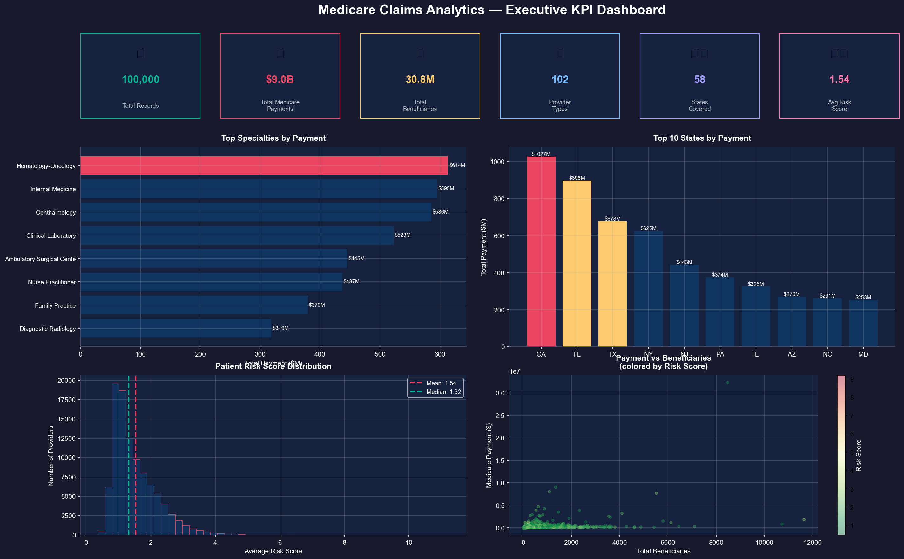
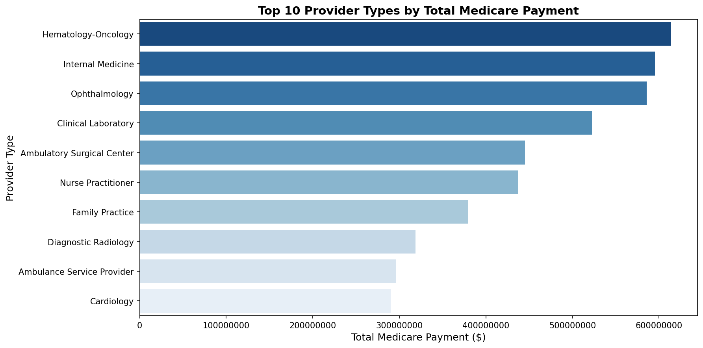
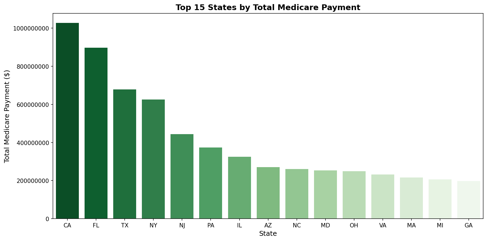
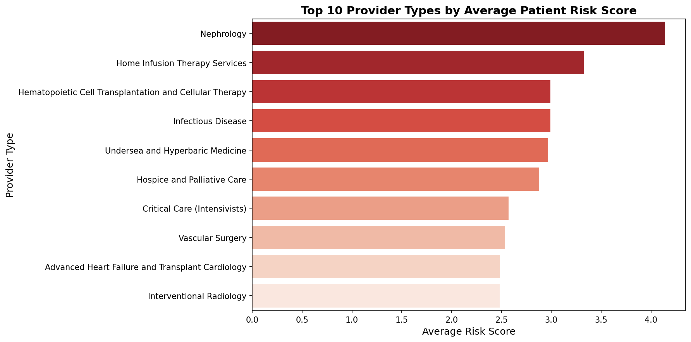
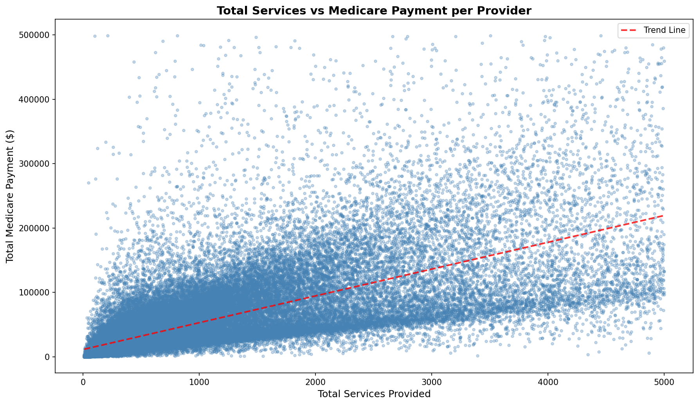
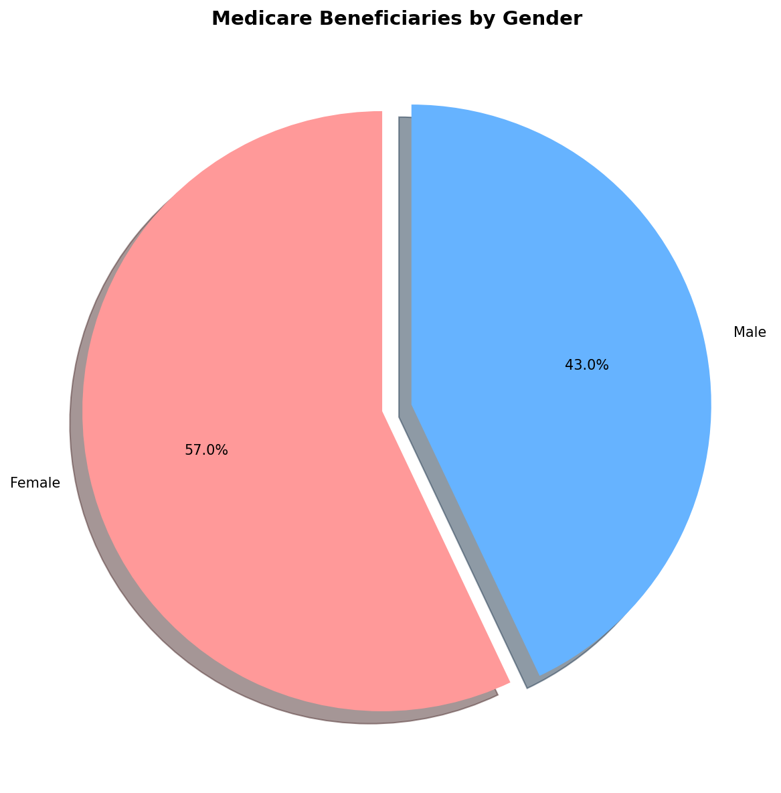
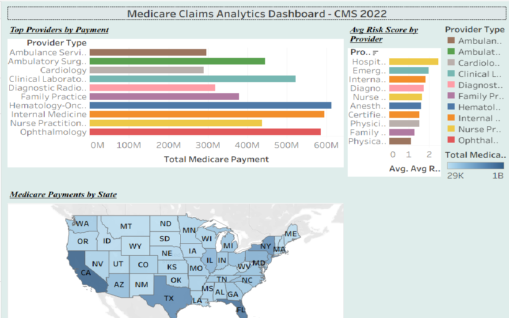
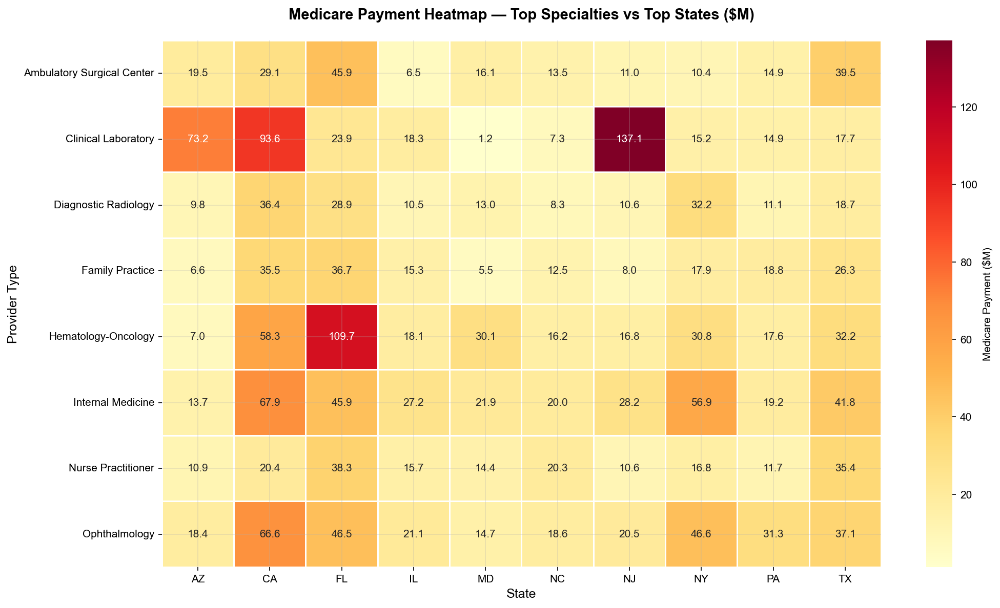
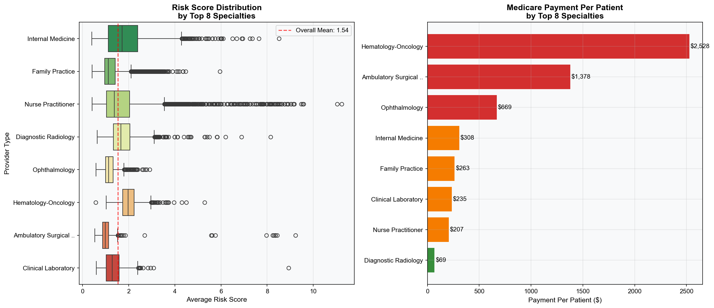
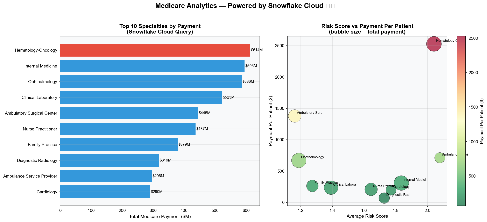

# 🏥 Medicare Claims Analytics Project
## End-to-End Healthcare Analytics Pipeline | Python · SQL · Snowflake · Tableau · Excel



## 🎯 Project Overview
End-to-end healthcare analytics project analyzing **100,000+ real Medicare records** from CMS 2022 dataset. Built in 3 phases — from raw ETL pipeline to advanced SQL analysis, automated data quality framework, Snowflake cloud integration, and executive KPI dashboards.

## 📊 Key Metrics
| Metric | Value |
|--------|-------|
| 📝 Records Analyzed | 100,000+ |
| 💰 Total Medicare Payments | $8.9 Billion |
| 👥 Total Beneficiaries | 30.7 Million |
| 🏥 Provider Types | 102 |
| 🗺️ States Covered | 58 |
| ⚕️ Avg Patient Risk Score | 1.54 |
| ☁️ Cloud Platform | Snowflake (AWS) |

## 🔍 Key Findings
- 💰 **Hematology-Oncology** charges **$2,528 per patient** — highest of all specialties
- 🚨 Identified **15+ high-value providers** billing 200%+ above specialty average — compliance risk
- 📍 **California** leads with $1B+ in payments; **Texas** ranks 3rd at $678M
- 🏥 **Clinical Laboratory in NJ** is the biggest state-specialty outlier at $137M
- 📊 **Diagnostic Radiology** most cost-efficient at $69 per patient
- 🔴 **Florida** has highest patient risk score (1.71) and oldest patients (73.7 avg age)
- ☁️ **100,000 records** successfully loaded and queried on Snowflake cloud warehouse

## 🛠️ Tech Stack
| Category | Tools |
|----------|-------|
| Language | Python 3.12 |
| Data Processing | Pandas, NumPy |
| Database | SQLite, Snowflake Cloud |
| Visualization | Matplotlib, Seaborn, Tableau |
| Reporting | OpenPyXL (Excel) |
| Cloud | Snowflake (AWS, US-East) |
| Version Control | Git, GitHub |
| Environment | Jupyter Notebook, VS Code, Anaconda |

## 📁 Project Structure

```
healthcare-claims-project/
│
├── data/                            → Raw CMS Medicare 2022 dataset
├── notebooks/
│   ├── 01_data_exploration.ipynb    → Phase 1: ETL, cleaning, basic charts
│   ├── 02_advanced_analysis.ipynb   → Phase 2: SQL, KPIs, advanced charts
│   └── 03_snowflake_pipeline.ipynb  → Phase 3: Snowflake cloud integration
├── output/
│   ├── medicare_clean.csv           → Cleaned dataset (Phase 1)
│   ├── medicare_analytics.db        → SQLite database (Phase 2)
│   ├── medicare_quality_report.xlsx → Automated quality report (Phase 2)
│   ├── executive_kpi_dashboard.png  → Executive dashboard (Phase 2)
│   ├── heatmap_specialty_state.png  → Heatmap (Phase 2)
│   ├── risk_payment_analysis.png    → Risk & payment analysis (Phase 2)
│   ├── snowflake_cloud_analysis.png → Snowflake cloud chart (Phase 3)
│   ├── top_providers.png            → Top providers chart (Phase 1)
│   ├── top_states.png               → Top states chart (Phase 1)
│   ├── avg_risk_score.png           → Risk score chart (Phase 1)
│   ├── services_vs_payment.png      → Scatter plot (Phase 1)
│   ├── gender_distribution.png      → Gender pie chart (Phase 1)
│   └── dashboard.png                → Tableau dashboard screenshot
└── README.md
```

## 🚀 Phase 1 — Data Exploration & Visualization
### What We Built
- ✅ Loaded and explored 100,000 real CMS Medicare 2022 records
- ✅ Selected 15 key columns from 81 total
- ✅ Built data cleaning pipeline with null handling and validation
- ✅ Saved clean dataset for downstream analysis
- ✅ Built 5 professional visualizations

### Phase 1 Visualizations

#### Top 10 Provider Types by Medicare Payment


#### Top 15 States by Medicare Payment


#### Average Patient Risk Score by Provider Type


#### Services vs Medicare Payment


#### Gender Distribution of Beneficiaries


#### Tableau Dashboard


## 🚀 Phase 2 — Advanced SQL Analysis & KPI Dashboards
### What We Built
- ✅ Loaded clean data into real SQLite database
- ✅ Built 4 advanced SQL queries with CTEs and window functions
- ✅ Built automated data quality framework (completeness, validity, consistency)
- ✅ Generated professional Excel report with 6 sheets
- ✅ Built executive KPI dashboard with dark theme
- ✅ Built specialty vs state payment heatmap
- ✅ Built risk score distribution and payment per patient analysis

### Phase 2 Visualizations

#### Executive KPI Dashboard


#### Specialty vs State Payment Heatmap


#### Risk Score & Payment Per Patient Analysis


## 🚀 Phase 3 — Snowflake Cloud Integration
### What We Built
- ✅ Connected Python to Snowflake cloud data warehouse (AWS)
- ✅ Loaded 100,000 Medicare records to Snowflake cloud
- ✅ Ran advanced SQL with RANK() window functions on cloud
- ✅ Built visualization directly from live Snowflake data
- ✅ Secured credentials using environment variables
- ✅ Properly managed cloud connection and resources

### Snowflake Details
| Property | Value |
|----------|-------|
| Cloud Provider | AWS |
| Region | US East (N. Virginia) |
| Database | MEDICARE_DB |
| Schema | PUBLIC |
| Table | MEDICARE_CLAIMS |
| Warehouse | COMPUTE_WH (X-Small) |
| Records Loaded | 100,000 |

### Phase 3 Visualization

#### Medicare Analytics — Powered by Snowflake Cloud


## 🗄️ SQL Analysis Highlights

### Phase 2 — SQLite Queries
- **Query 1:** Top specialties by total payment, avg payment per provider, payment per patient
- **Query 2:** State-level KPI breakdown — providers, patients, risk scores, avg age
- **Query 3:** High-value provider outlier detection (200%+ above specialty average)
- **Query 4:** Payment efficiency score — patients served per $1,000 Medicare spend

### Phase 3 — Snowflake Cloud Queries
- **Query 1:** Top 10 specialties KPI analysis on cloud warehouse
- **Query 2:** State rankings using RANK() window function on Snowflake
- **Query 3:** Live data extraction for cloud-powered visualization

## ✅ Data Quality Framework
Automated checks covering:
- **Completeness** — null checks across all 15 columns
- **Validity** — negative values, invalid ages, out-of-range risk scores
- **Consistency** — payment vs charges reconciliation, duplicate detection
- **Result:** 100% PASS across all quality checks

## 🔒 Security
- Snowflake credentials stored in `.env` file — never committed to GitHub
- `.env` added to `.gitignore` for security
- Environment variables used for all sensitive credentials
